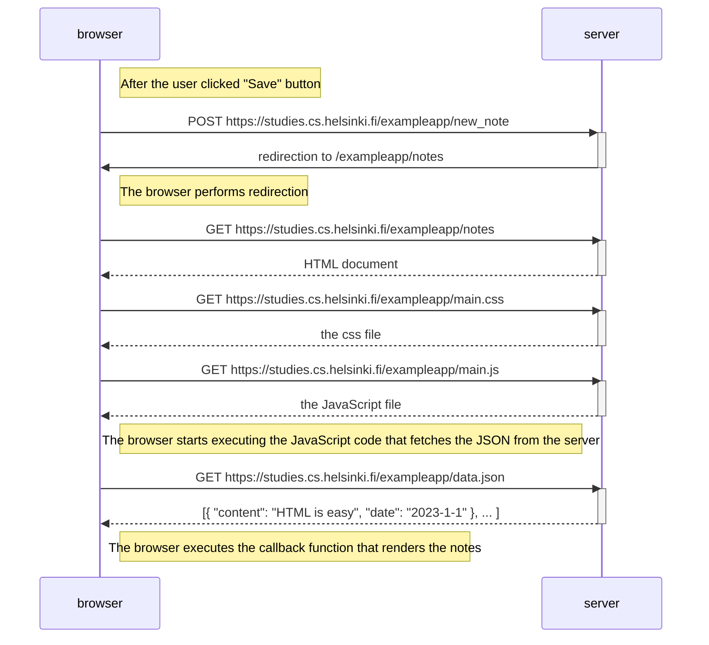

```mermaid
sequenceDiagram

    Note right of b: After the user clicked "Save" button 

    participant b as browser

    participant s as server

  

    b->>+s: POST https://studies.cs.helsinki.fi/exampleapp/new_note

    s->>-b: redirection to /exampleapp/notes

  

    Note right of b: The browser performs redirection

  

    b->>s: GET https://studies.cs.helsinki.fi/exampleapp/notes

    activate s

    s-->>b: HTML document

    deactivate s

  

    b->>s: GET https://studies.cs.helsinki.fi/exampleapp/main.css

    activate s

    s-->>b: the css file

    deactivate s

  

    b->>s: GET https://studies.cs.helsinki.fi/exampleapp/main.js

    activate s

    s-->>b: the JavaScript file

    deactivate s

  

    Note right of b: The browser starts executing the JavaScript code that fetches the JSON from the server

  

    b->>s: GET https://studies.cs.helsinki.fi/exampleapp/data.json

    activate s

    s-->>b: [{ "content": "HTML is easy", "date": "2023-1-1" }, ... ]

    deactivate s

  

    Note right of b: The browser executes the callback function that renders the notes
```