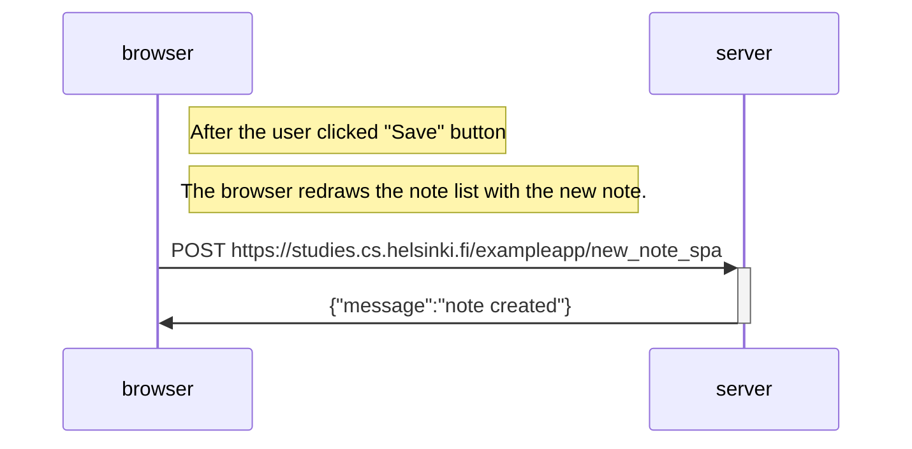

```mermaid
sequenceDiagram

    participant b as browser

    participant s as server

    Note right of b: After the user clicked "Save" button   

    Note right of b:The browser redraws the note list with the new note.

  

    b->>+s: POST https://studies.cs.helsinki.fi/exampleapp/new_note_spa

    s->>-b: {"message":"note created"}
```